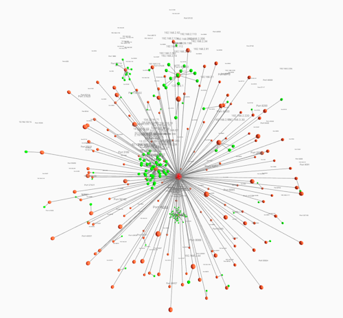

# Network Connections Card 3D orb

A **custom Lovelace card** for **Home Assistant** that visualizes active network connections in an interactive 3D orb graph using [three.js](https://threejs.org/). This card transforms your network connection data into a dynamic 3D scene featuring:

- **Central Hub**: Represents your main network node, positioned at the center.
- **Ports**: Evenly distributed around the hub on a spherical layout.
- **IP Addresses**: Bloom around each port with collision avoidance for a clear view.
- **Dynamic Labels**: Node labels update in real time, adjusting their size and position based on camera distance.
- **Smooth Animation**: Enjoy seamless zoom, pan, and orbit interactions with OrbitControls.



## Features

1. **3D Orb Visualization**  
   Presents network connections in a visually engaging 3D space with a central hub, peripheral port nodes, and blooming IP nodes.

2. **Real-Time Updates**  
   The card updates dynamically based on sensor data from Home Assistant, ensuring that your network graph reflects the latest connection status.

3. **Interactive Controls**  
   Navigate the 3D scene effortlessly with mouse or touch gestures, thanks to OrbitControls which support smooth zooming, panning, and rotation.

4. **Dynamic Labeling**  
   Labels adjust their size and position relative to the camera, enhancing readability regardless of node distance.

## Installation

### HACS

1. Add this repository as a custom HACS repository with the type **Dashboard**.
2. Install the card through HACS.

### Manual Installation

1. **Place the Card File**  
   - Download `ha_network-connections-card-3d.js` from this repository.
   - Place it in your Home Assistant `www/` directory (e.g., `<config>/www/ha_network-connections-card-3d.js`).

2. **Add to Lovelace Resources**  
   - Navigate to Home Assistant → **Settings** → **Dashboards** → **Resources**.
   - Create a new resource with the following configuration:
     ```yaml
     url: /local/ha_network-connections-card-3d.js
     type: module
     ```
   - Note: `/local/` maps to the `www` folder in Home Assistant.

3. **Configure a Lovelace Dashboard Card**  
   - In your Lovelace dashboard, add a **Manual Card** with:
     ```yaml
     type: custom:network-connections-card-3d
     title: Active Network Connections (3D)
     entity: sensor.network_connections
     ```
   - Adjust the `entity` field if your sensor has a different name.

## Configuration

### Data Format

The card expects a sensor entity that exposes an attribute named `connections`, which should be an array of objects in the following format:

```json
[
  { "source": "192.168.2.10", "sport": 1234, "target": "8.8.8.8", "port": 443 },
  { "source": "192.168.2.11", "sport": 5678, "target": "192.168.2.5", "port": 80 }
]

```

The sensor for host information is the following configuration (using a command_line sensor) in your configuration.yaml might look like this. WARNING: this is build for a fedora instance, and it could be possible that your command differs in your OS, so please test it according. You can also have a look at https://github.com/RoyOltmans/ha_netstat-overview-card for a more basic overview to understand whats happening:

```YAML
command_line:
  - sensor:
        name: Network Connections
        command: "netstat -ntu | awk '{if (NR>2) print $4, $5}' | awk -F'[: ]+' '{print $(NF-3), $(NF-2), $(NF-1), $(NF)}' | grep -E '^[0-9]+\\.[0-9]+\\.[0-9]+\\.[0-9]+ [0-9]+ [0-9]+\\.[0-9]+\\.[0-9]+\\.[0-9]+ [0-9]+$' | jq -c -R '[inputs | capture(\"(?<source>[0-9.]+) (?<sport>[0-9]+) (?<target>[0-9.]+) (?<port>[0-9]+)\") | {source, sport: ( .sport | tonumber ), target, port: ( .port | tonumber )}] | {connections: .}'"
        value_template: "{{ value_json.connections | length }}"
        json_attributes:
          - connections
        scan_interval: 60
```

## Usage

### View & Interact
Use your mouse or touch gestures to orbit, zoom, and pan within the 3D scene. Explore your network graph as it dynamically updates based on the latest sensor data.

### Dynamic Labels
Labels for the hub, ports, and IP nodes are automatically adjusted for clarity based on their distance from the camera.

## Troubleshooting

### Card Not Displaying?
Ensure the resource URL is correctly configured and that the card is referenced as `custom:network-connections-card-3d` in your Lovelace dashboard.

### No Data or Nodes?
Verify that your sensor entity has the `connections` attribute and that it is returning data in the expected format.

### Layout Issues?
Check the browser console for any errors related to three.js or OrbitControls. Ensure all necessary scripts are loading properly.

## License
This project is licensed under the MIT License. See the LICENSE file for more details.

## Acknowledgements
- Built using [three.js](https://threejs.org/) for interactive 3D visualization.
- Inspired by community projects that bring network monitoring into Home Assistant's Lovelace UI.
- This is a community-driven project. Use responsibly and ensure sensitive network data is protected.

**Disclaimer:** This project is community-maintained and is not officially affiliated with Home Assistant or any network hardware vendors.
